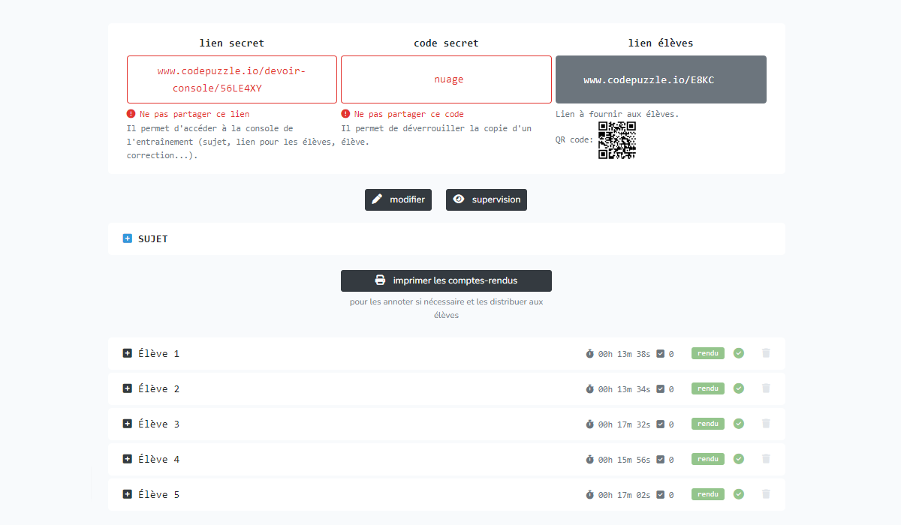

---
hide:
  - footer
---

# ENTRAÎNEMENTS / DEVOIRS

## 1. Créer un nouvel Entraînement / devoir
Pour créer un nouvel Entraînement / Devoir: [www.codepuzzle.io/devoir-creer](https://www.codepuzzle.io/devoir-creer)

Seul le champ "consignes" est obligatoire.

### Consignes
Les consignes peuvent être saisies en Markdown / Latex.

### Code élève

### Code enseignant

### Solution possible

### Options

## 2

## 3

## 4

## 5

## 6

## 7

## 8

## 9

## 10

## 11

