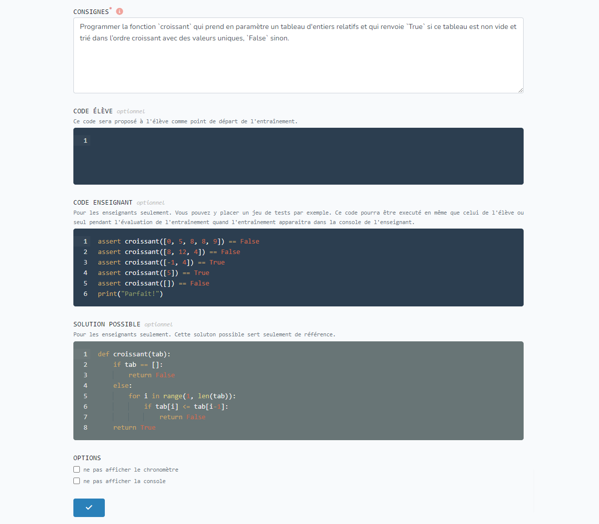
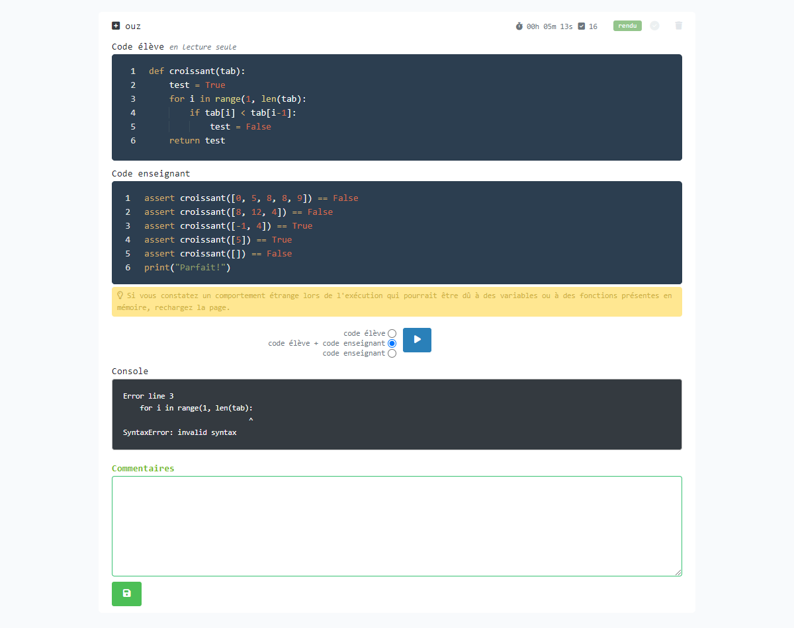

---
hide:
  - footer
---

# ENTRAÎNEMENTS / DEVOIRS

## 1. Créer un nouvel entraînement / devoir [enseignant]
Pour créer un nouvel entraînement / devoir: [www.codepuzzle.io/devoir-creer](https://www.codepuzzle.io/devoir-creer)

Seul le champ "consignes" est obligatoire.

### Consignes
Les consignes peuvent être saisies en Markdown / Latex.

### Code élève
Le code saisi dans ce champ apparaîtra dans l'éditeur de l'élève. 

### Code enseignant
Le code saisi dans ce champ ne sera pas visible par l'élève. Il peut servir pour l'évaluation. Cela peut être des assertions, du code qui s'appuie sur les bibliothèques Inspect ou AST ou tout code utile pour l'enseignant. Ce code peut être exécuté lors de l'évaluation, seul ou ajouté au code de l'élève. Lors de l'évaluation, l'enseignant pourra modifier ce champ.

### Solution possible
Le code saisi dans ce champ ne sera pas visible par l'élève. Il peut contenir une solution possible au problème posé. 

### Options
Les options permettent de cacher le chronomètre ou la console sur la page de l'élève.

## 2. En-tête de la console de l'enseignant [enseignant]

Après la création d'un nouvel entraînement / devoir, la page de la console de l'enseignant apparaît. L'adresse de cette page ne doit être connue que de l'enseignant.
A partir de cette page, l'enseignant peut:
* de prendre connaissance du code secret qui permet déverrouiller une page d'élève
* de prendre connaissance du lien à distribuer aux élèves
* de modifier l'entraînement / devoir
* d'accéder à la page de supervision des travaux

C'est aussi sur cette page que les travaux des élèves apparaîtront et qu'ils pourront être évalués.

## 3. Identifiant et consignes générales  [élève]

Le lien fourni aux élèves les amène sur cette page. L'élève saisit un identifiant, lit les consignes générales et les valide. 

## 4. Espace de travail de l'élève [élève]

Sur cette page, l'élève prend connaissance du sujet, écrit son code dans l'éditeur et l'exécute. Une fois le travail terminé, l'élève clique sur le bouton "rendre".

## 5. Verrouillage de l'espace de travail de l'élève [élève]

Si l'élève sort de son espace de travail, sa page se verrouille. Seul l'enseignant peut déverrouiller la page.

## 6. Supervision des travaux en temps réel [enseignant]

Depuis la page "supervision", l'enseignant peut suivre les travaux des élèves en temps réel et déverrouiller à distance des espaces de travail d'élèves. 

## 8

## 9

## 10

## 11

